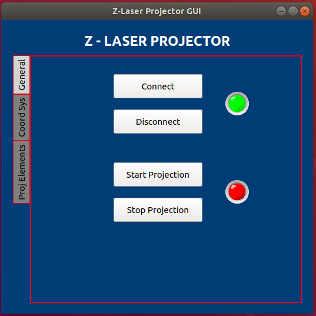
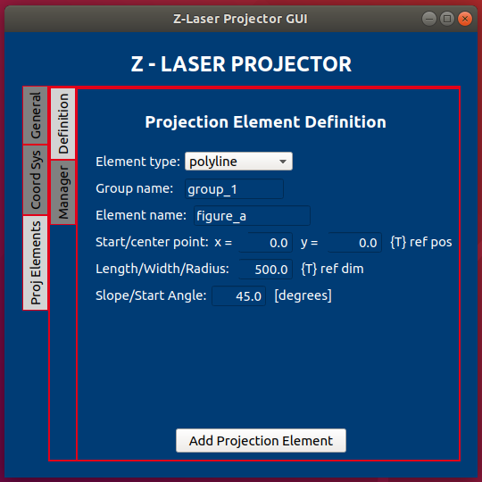

# z_laser_gui

z_laser_gui provides a graphical interface that improves the user interaction with the ROS API provided by the z_laser_projector stack. It wraps the messages publication and services call which have been arranged to run the functionalities of the device

  
  

For more information read the [ROS Wiki page](http://wiki.ros.org/z_laser_gui)