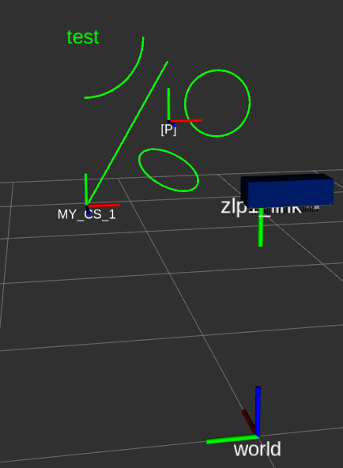

# z_laser_viz

z_laser_viz provides a visualizer for laser projections in RViz of the user-defined elements and locates the origin axes of reference systems. This package is used in combination with ``z_laser_zlp1`` to ease the use and configuration of the projector.

The visualizer is based on [visualization_msgs/Marker](http://docs.ros.org/en/api/visualization_msgs/html/msg/Marker.html) to simulate the laser projection of figures defined by the user. For example lines, circles, text, etc.

On the other hand, the visualizer also uses [tf](http://wiki.ros.org/tf) package to place the origin axes of the active user-defined reference system and the projector reference system. 

  

For more information read the [ROS Wiki page](http://wiki.ros.org/z_laser_viz)